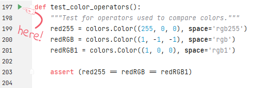

# Contributing to the PsychoPy Test Suite
## Why do we need a test suit?

With any bit of software, no matter how perfect the code seems as you're writing it, there will be bugs. We use a test suite to make sure that we find as many of those bugs as we can before users do, it's always better to catch them in development than to have them mess up someone's experiment once the software is out in the wild. Remember - when a user finds a bug, they react like this:


...but when the test suite finds a bug, developers react like this:


The more bugs the test suite finds, the better!

## How does it work?
The test suite uses a Python module called [pytest](https://pypi.org/project/pytest/) to run tests on various parts of the PsychoPy code. These tests work by calling functions, initialising objects and generally trying to use as much of the code in the PsychoPy repo as possible - then, if an uncaught error is hit at any point, `pytest` will spit out some informative text on what went wrong. This means that, if the test suite can run without error, then the software can do everything done in the test suite without error.

To mark something as a test, it needs three things:

1. It must be somewhere in the folder `psychopy/psychopy/tests`
2. It must contain the word `test` in its name (i.e. the class name and function names)
4. It must be executable in code, a function or a method

So, for example, if you were to make a test for the `visual.Rect` class, you might call the file `test_rect.py` and put it in `psychopy/psychopy/tests/test_all_visual`, and the file might look like this:

```python
from psychopy import visual  # used to draw stimuli

def test_rect():
    # Test that we can create a window and a rectangle without error
    win = visual.Window()
    rect = visual.Rect(win)
    # Check that they draw without error
    rect.draw()
    win.flip()
    # End test
    win.close()
    
```

## Using `assert`

Sometimes there's more to a bit of code than just running without error - we need to check not just that it doesn't crash, but that the output is as expected. The `assert` function allows us to do this. Essentially, `assert` will throw an `AssertionError` if the first input is `False`, with the text of this error determined by the second input. So, for example:

```python
assert 2 < 1, "2 is not less than 1"
```

will raise:

```
AssertionError: 2 is not less than 1
```

In essence, an `assert` call is the same as saying:

```python
if condition == False:
    raise AssertionError(msg)
```

What this means is that we can raise an error if a value is not what we expect it to be, which will cause the test to fail if the output of a function is wrong, even if the function ran without error.

You could use `assert` within the `test_rect` example like so:

```python
# Set the rectangle's fill color
rect.colorSpace = 'rgb'
rect.fillColor = (1, -1, -1)
# Check that the rgb value of its fill color is consistent with what we set 
assert rect._fillColor == colors.Color('red'), f"Was expecting rect._fillColor to have an rgb value of '(1, -1, -1)', but instead it was '{rect._fillColor.rgb}'"
```

Meaning that, if something was wrong with `visual.Rect` such that setting its `fillColor` attribute didn't set the rgb value of its fill color correctly, this test would raise an `AssertionError` and would print both the expected and actual values. This process of comparing actual outputs against expected outputs is known as "end-to-end" (e2e) testing, while simply supplying values to see if they cause an error is called "unit" testing.

## Using classes

In addition to individual methods, you can also create a `class` for tests. This approach is useful when you want to avoid making loads of objects for each test, as you can simple create an object once and then refer back to it. For example:

```python
class TestRect:
    """ A class to test the Rect class """
    @classmethod
    def setup_class(self):
        """ Initialise the rectangle and window objects """
        # Create window
        self.win = visual.Window()
        # Create rect
        self.rect = visual.Rect(self.win)

    def test_color(self):
        """ Test that the color or a rectangle sets correctly """
        # Set the rectangle's fill color
        self.rect.colorSpace = 'rgb'
        self.rect.fillColor = (1, -1, -1)
        # Check that the rgb value of its fill color is consistent with what we set
        assert self.rect._fillColor == colors.Color('red'), f"Was expecting rect._fillColor to have an rgb value of '(1, -1, -1)'," \
                                              f" but instead it was '{self.rect._fillColor.rgb}'"
```

Of course, you could create a window and a rectangle for each function and it would work just the same, but only creating one means the test suite doesn't have as much to do so it will run faster. Test classes work the same as any other class definition, except that rather than `__init__`, the constructor function should be `setup_class`, and this should be marked as a `@classmethod` as in the example above.

---
**Exercise**

Practicing writing tests? Try extending the above class to test if a created rectangle has 4 vertices.

---
## Running tests in PyCharm

One of the really useful features on PyCharm is its ability to run tests with just a click. If you have `pytest` installed, then any valid test will have a green play button next to its name, in the line margins:



Clicking this button will start all the necessary processes to run this test, just like it would run in our test suite. This button also appears next to test classes, clicking the run button next to the class name will create an instance of that class, then run each of its methods which are valid tests.

## Test utils

The test suite comes with some handy functions and variables to make testing easier, all of which can be accessed by importing `psychopy.tests.utils`.

#### Paths

The test utils module includes the following paths: 

- `TESTS_PATH` : A path to the root tests folder
- `TESTS_DATA_PATH` : A path to the data folder within the tests folder - here is where all screenshots, example conditions files, etc. for use by the test suite are stored

#### Compare screenshot

This function allows you to compare the appearance of a `visual.Window` to an image file, raising an `AssertionError` if they aren't sufficiently similar. This takes three arguments:

- `fileName` : A path to the image you want to compare against
- `win` : The window you want to check
- `crit` (optional) : A measure of how lenient to be - this defaults to 5, but we advise increasing it to 20 for anything involving fonts as these can vary between machines

If `filename` points to a file which doesn't exist, then this function will instead save the window and assume true. Additionally, if the comparison fails, the window will be saved as the same path as `filename`, but with `_local` appended to the name.

#### Compare pixel color

Sometimes, comparing an entire image may be excessive for what you want to check. For example, if you just want to make sure that a fill color has applied, you could just compare the color of one pixel. This means there doesn't need to be a `.png` file in the PsychoPy repository, and the test suite also doesn't have to load a entire image just to compare one color. In these instances, it's better to use `utils.comparePixelColor`. This function takes three arguments:

- `screen` : The window you want to check
- `color` : The color you expect the pixel to be (ideally, this should be a `colors.Color` object)
- `coord` (optional) : The coordinates of the pixel within the image which you're wanting to compare (defaults to `(0, 0)`)

Contained within this function is an `assert` call - so if the two colors are not the same, it will raise an `AssertionError` giving you information on both the target color and the pixel color.

## Exemplars and tykes

While you're welcome to lay out your tests however makes the most sense for that test, a useful format in some cases it to define `list`s of "exemplars" and "tykes" - `dict`s of attributes for use in a `for` loop, to save yourself from manually writing the same code over and over, with "exemplars" being very typical use cases which should definitely work as a bare minimum, and "tykes" being edge cases which should work but are not necessarily likely to occur. Here's an example of this structure:

```python
from psychopy import visual, colors  # used to draw stimuli


class TestRect:
    """ A class to test the Rect class """
    @classmethod
    def setup_class(self):
        """ Initialise the rectangle and window objects """
        # Create window
        self.win = visual.Window()
        # Create rect
        self.rect = visual.Rect(self.win)

    def test_color(self):
        """ Test that the color or a rectangle sets correctly """
        # Set the rectangle's fill color
        self.rect.colorSpace = 'rgb'
        self.rect.fillColor = (1, -1, -1)
        # Check that the rgb value of its fill color is consistent with what we set
        assert self.rect._fillColor == colors.Color('red'), f"Was expecting rect._fillColor to have an rgb value of '(1, -1, -1)'," \
                                              f" but instead it was '{self.rect._fillColor.rgb}'"

    def test_rect_colors(self):
        """Test a range of known exemplar colors as well as colors we know to be troublesome AKA tykes"""
        # Define exemplars
        exemplars = [
            { # Red with a blue outline
                'fill': 'red',
                'border': 'blue',
                'colorSpace': 'rgb',
                'targetFill': colors.Color((1, -1, -1), 'rgb'),
                'targetBorder': colors.Color((-1, -1, 1), 'rgb'),
            },
            { # Blue with a red outline
                'fill': 'blue',
                'border': 'red',
                'colorSpace': 'rgb',
                'targetFill': colors.Color((-1, -1, 1), 'rgb'),
                'targetBorder': colors.Color((1, -1, -1), 'rgb'),
            },
        ]
        # Define tykes
        tykes = [
            { # Transparent fill with a red border when color space is hsv
                'fill': None,
                'border': 'red',
                'colorSpace': 'rgb',
                'targetFill': colors.Color(None, 'rgb'),
                'targetBorder': colors.Color((0, 1, 1), 'hsv'),
            }
        ]
        # Iterate through all exemplars and tykes
        for case in exemplars + tykes:
            # Set colors
            self.rect.colorSpace = case['colorSpace']
            self.rect.fillColor = case['fill']
            self.rect.borderColor = case['border']
            # Check values are the same
            assert self.rect._fillColor == case['targetFill'], f"Was expecting rect._fillColor to be '{case['targetFill']}', but instead it was '{self.rect._fillColor}'"
            assert self.rect._borderColor == case['targetBorder'], f"Was expecting rect._borderColor to be '{case['targetBorder']}', but instead it was '{self.rect._borderColor}'"
        
```

## Cleanup

After opening any windows, initialising objects or opening any part of the app, it's important to do some cleanup afterwards - otherwise these won't close and the test suite will just keep running forever. This just means calling `.Close()` on any `wx.Frame`s, `.close()` on any `visual.Window`s, and using `del` to get rid of any objects.

For functions, you can just do this at the end of the function, before it terminates. For classes, this needs to be done in a method called `teardown_class`; as `pytest` will call this method when the tests have completed. This method also needs to have a decorator marking it as a `classfunction`, like so:

```python
from psychopy import visual

class ExampleTest:
    def __init__(self):
        # Start an app
        wx.App()
        # Create a frame
        self.frame = wx.Frame()
        # Create a window
        self.win = visual.Window()
        # Create an object
        self.rect = visual.Rect(win)
     
    @classmethod
    def teardown_class(self):
        # Close the frame
        self.frame.Close()
        # Close the window
        self.win.close()
        # Delete the object
        del self.rect
```

---
**Exercise**

Add a `teardown_class` method to your TestRect class.

---
## CodeCov

CodeCov is a handy tool which runs the full test suite and keeps track of which lines of code are executed - giving each file in the PsychoPy repo a percentage score for "coverage". If more lines of code in that file are executed when the test suite runs, then it has a higher coverage score. You can view the full coverage report for the repo [here](https://app.codecov.io/gh/psychopy/psychopy/).

Some areas of the code are more important than others, so it's important not to make decisions purely based on what most increases coverage, but coverage can act as a good indicator for what areas the test suite is lacking in. If you want to make a test but aren't sure what to do, finding a file or folder with a poor coverage score is a great place to start!

---
**Solutions**

Testing if a created rectangle has 4 vertices:

```python
def test_rect(self):
    """ Test that a rect object has 4 vertices """
    assert len(self.rect.vertices) == 4, f"Was expecting 4 vertices in a Rect object, got {len(self.rect.vertices)}"

```

Adding a `teardown_class` method to your TestRect class:

```python

class TestRect:
    """ A class to test the Rect class """
    @classmethod
    def setup_class(self):
        """ Initialise the rectangle and window objects """
        # Create window
        self.win = visual.Window()
        # Create rect
        self.rect = visual.Rect(self.win)

    def test_color(self):
        """ Test that the color or a rectangle sets correctly """
        # Set the rectangle's fill color
        self.rect.colorSpace = 'rgb'
        self.rect.fillColor = (1, -1, -1)
        # Check that the rgb value of its fill color is consistent with what we set
        assert self.rect._fillColor == colors.Color('red'), f"Was expecting rect._fillColor to have an rgb value of '(1, -1, -1)'," \
                                              f" but instead it was '{self.rect._fillColor.rgb}'"

    def test_rect(self):
        """ Test that a rect object has 4 vertices """
        assert len(self.rect.vertices) == 4, f"Was expecting 4 vertices in a Rect object, got {len(self.rect.vertices)}"

    def test_rect_colors(self):
        """Test a range of known exemplar colors as well as colors we know to be troublesome AKA tykes"""
        # Define exemplars
        exemplars = [
            { # Red with a blue outline
                'fill': 'red',
                'border': 'blue',
                'colorSpace': 'rgb',
                'targetFill': colors.Color((1, -1, -1), 'rgb'),
                'targetBorder': colors.Color((-1, -1, 1), 'rgb'),
            },
            { # Blue with a red outline
                'fill': 'blue',
                'border': 'red',
                'colorSpace': 'rgb',
                'targetFill': colors.Color((-1, -1, 1), 'rgb'),
                'targetBorder': colors.Color((1, -1, -1), 'rgb'),
            },
        ]
        # Define tykes
        tykes = [
            { # Transparent fill with a red border when color space is hsv
                'fill': None,
                'border': 'red',
                'colorSpace': 'rgb',
                'targetFill': colors.Color(None, 'rgb'),
                'targetBorder': colors.Color((0, 1, 1), 'hsv'),
            }
        ]
        # Iterate through all exemplars and tykes
        for case in exemplars + tykes:
            # Set colors
            self.rect.colorSpace = case['colorSpace']
            self.rect.fillColor = case['fill']
            self.rect.borderColor = case['border']
            # Check values are the same
            assert self.rect._fillColor == case['targetFill'], f"Was expecting rect._fillColor to be '{case['targetFill']}', but instead it was '{self.rect._fillColor}'"
            assert self.rect._borderColor == case['targetBorder'], f"Was expecting rect._borderColor to be '{case['targetBorder']}', but instead it was '{self.rect._borderColor}'"

    @classmethod
    def teardown_class(self):
        """clean-up any objects, wxframes or windows opened by the test"""
        # Close the window
        self.win.close()
        # Delete the object
        del self.rect
```
---

